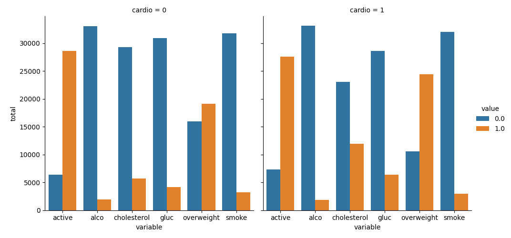
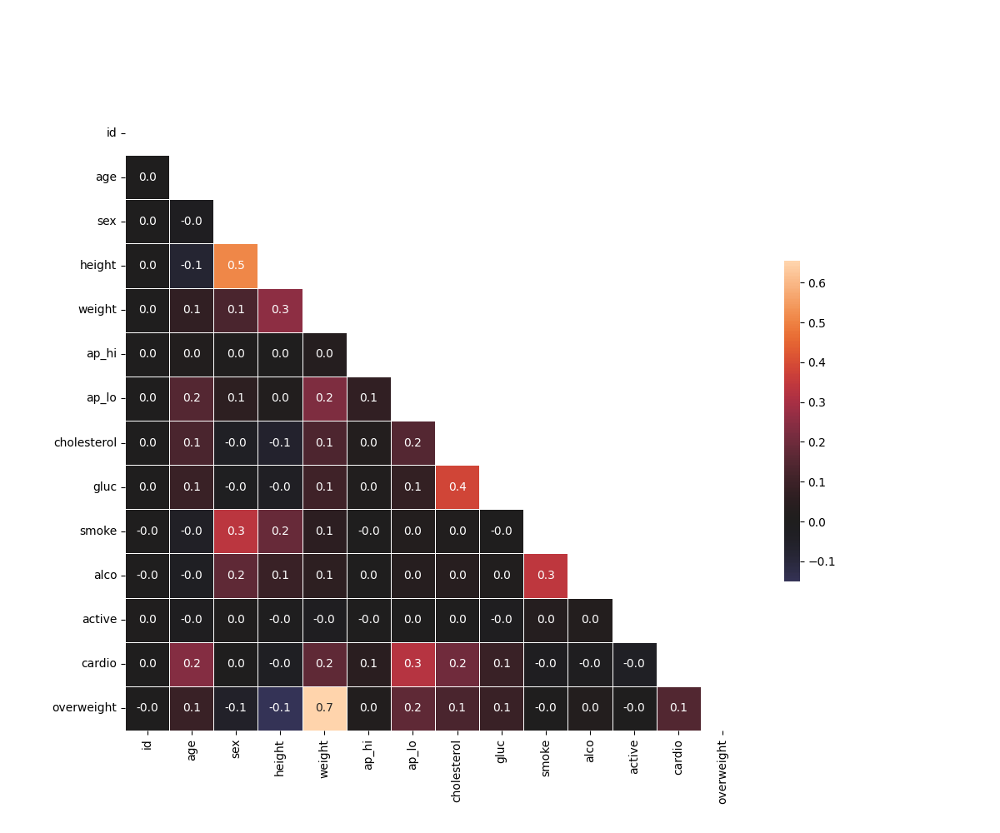

# Project 3 - Medical Data Visualizer
- visualize and make calculations from medical examination data using matplotlib, seaborn, and pandas.
- The dataset values were collected during medical examinations.
- You must use Pandas to perform the following:
    * Import the data from medical_examination.csv and assign it to the df variable
    * Add an overweight column to the data. To determine if a person is overweight, first calculate their BMI by dividing their weight in kilograms by the square of their height in meters. If that value is > 25 then the person is overweight. Use the value 0 for NOT overweight and the value 1 for overweight.
    * Normalize data by making 0 always good and 1 always bad. If the value of cholesterol or gluc is 1, set the value to 0. If the value is more than 1, set the value to 1.
    * Draw the Categorical Plot in the draw_cat_plot function.
    * Create a DataFrame for the cat plot using pd.melt with values from cholesterol, gluc, smoke, alco, active, and overweight in the df_cat variable.
    * Group and reformat the data in df_cat to split it by cardio. Show the counts of each feature. You will have to rename one of the columns for the catplot to work correctly.
    * Convert the data into long format and create a chart that shows the value counts of the categorical features using the following method provided by the seaborn library import: sns.catplot().
    * Get the figure for the output and store it in the fig variable.
    * Do not modify the next two lines.
    * Draw the Heat Map in the draw_heat_map function.
    * Clean the data in the df_heat variable by filtering out the following patient segments that represent incorrect data:
      - diastolic pressure is higher than systolic (Keep the correct data with (df['ap_lo'] <= df['ap_hi']))
      - height is less than the 2.5th percentile (Keep the correct data with (df['height'] >= df['height'].quantile(0.025)))
      - height is more than the 97.5th percentile
      - weight is less than the 2.5th percentile
      - weight is more than the 97.5th percentile

* output graphs

Used Python

View in [Gitpod](https://freecodecam-boilerplate-ew8oe8vwt0j.ws-us120.gitpod.io)
